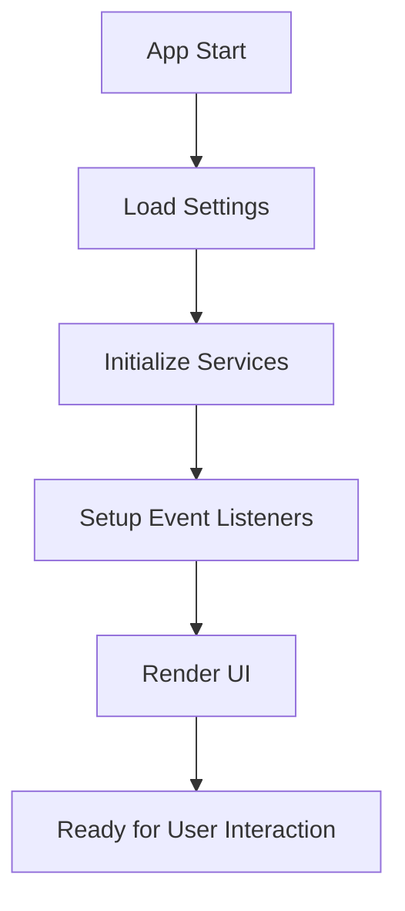
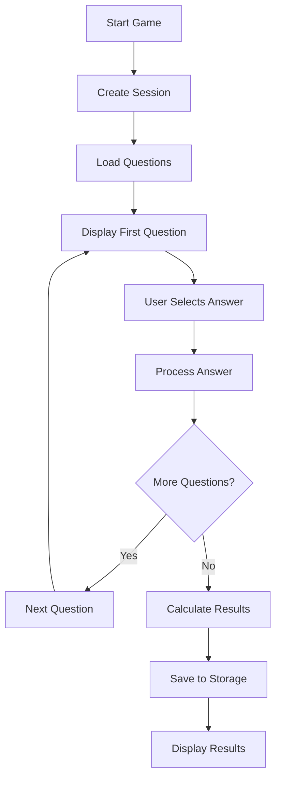

# Technical Architecture

This document provides a comprehensive overview of the US Civics Test website architecture, design decisions, and implementation details.

## Table of Contents

- [System Overview](#system-overview)
- [Architecture Patterns](#architecture-patterns)
- [Core Technologies](#core-technologies)
- [Data Flow](#data-flow)
- [Component Design](#component-design)
- [Service Layer](#service-layer)
- [State Management](#state-management)
- [Performance Strategy](#performance-strategy)
- [Security Considerations](#security-considerations)
- [Testing Strategy](#testing-strategy)

## System Overview

The US Civics Test website is a client-side React application built with Next.js 15, designed as a Progressive Web App (PWA) for optimal performance and accessibility.

### High-Level Architecture

```
┌─────────────────────────────────────────────────────────────┐
│                    Client Browser                           │
├─────────────────────────────────────────────────────────────┤
│  React Components (UI Layer)                               │
│  ├── Layout & Navigation                                   │
│  ├── Game Interface                                        │
│  ├── Results Dashboard                                     │
│  └── Accessibility Features                               │
├─────────────────────────────────────────────────────────────┤
│  Custom Hooks (Behavior Layer)                            │
│  ├── useGameSounds (Audio Feedback)                       │
│  ├── useKeyboardNavigation (Accessibility)                │
│  └── State Management Hooks                               │
├─────────────────────────────────────────────────────────────┤
│  Effect-TS Services (Business Logic)                      │
│  ├── QuestionDataService                                  │
│  ├── SessionService                                       │
│  └── LocalStorageService                                  │
├─────────────────────────────────────────────────────────────┤
│  Browser APIs                                             │
│  ├── LocalStorage (Data Persistence)                     │
│  ├── Web Audio API (Sound Effects)                       │
│  └── MediaQuery API (Theme Detection)                    │
└─────────────────────────────────────────────────────────────┘
```

### Key Design Principles

1. **Functional Programming**: Effect-TS for type-safe, composable business logic
2. **Component Composition**: Reusable, testable React components
3. **Accessibility First**: WCAG 2.1 compliance throughout
4. **Performance Focused**: Static generation, code splitting, optimized bundles
5. **Type Safety**: Strict TypeScript configuration with comprehensive typing

## Architecture Patterns

### 1. Hexagonal Architecture (Ports and Adapters)

The application follows hexagonal architecture principles:

```typescript
// Domain Layer (Core Business Logic)
interface GameSession {
  sessionId: string;
  settings: GameSettings;
  currentQuestionIndex: number;
  answers: QuestionAnswer[];
  startedAt: Date;
  completedAt?: Date;
}

// Application Layer (Use Cases)
class SessionService {
  createNewSession(settings: GameSettings): Effect<GameSession, never, never>
  processAnswer(session: GameSession, answer: QuestionAnswer): GameSession
  calculateResult(session: GameSession): GameResult
}

// Infrastructure Layer (External Dependencies)
class LocalStorageService {
  saveGameResult(result: GameResult): Effect<void, never, never>
  getGameResults(): Effect<GameResult[], never, never>
}
```

### 2. Effect-TS Functional Programming

All side effects are managed through Effect-TS:

```typescript
// Composable effects with automatic error handling
const setupGame = Effect.gen(function* () {
  const sessionService = yield* SessionService;
  const questionService = yield* QuestionDataService;
  
  const session = yield* sessionService.createNewSession(settings);
  const questions = yield* questionService.generateGameQuestions(10);
  
  return { session, questions };
});

// Runtime with dependency injection
Effect.runPromise(
  setupGame.pipe(
    Effect.provide(SessionService.Default),
    Effect.provide(QuestionDataService.Default)
  )
);
```

### 3. Component-Based Architecture

React components follow a clear hierarchy:

```
App (layout.tsx)
├── Layout
│   ├── Header
│   │   ├── Navigation
│   │   └── ThemeToggle
│   ├── Main Content
│   └── Footer
├── Game Page
│   ├── GameQuestion
│   ├── GameControls
│   └── GameResults
└── Results Page
    ├── StatsSummary
    └── ResultHistory
```

## Core Technologies

### Frontend Stack

| Technology | Version | Purpose |
|------------|---------|---------|
| **Next.js** | 15.3.5 | React framework with App Router |
| **React** | 19.0.0 | UI library with concurrent features |
| **TypeScript** | 5.x | Type safety and developer experience |
| **Tailwind CSS** | 4.x | Utility-first CSS framework |
| **Effect-TS** | 3.16.13 | Functional programming and effect management |

### Development Tools

| Tool | Purpose |
|------|---------|
| **Jest** | Unit and integration testing |
| **ESLint** | Code linting and formatting |
| **Prettier** | Code formatting |
| **GitHub Actions** | CI/CD pipeline |

### Browser APIs

- **LocalStorage**: Client-side data persistence
- **Web Audio API**: Sound effects and audio feedback
- **MediaQuery API**: Responsive design and theme detection
- **IntersectionObserver**: Performance optimization

## Data Flow

### 1. Application Initialization



### 2. Game Session Flow



### 3. Data Persistence

```typescript
// Effect-based data flow
const saveGameResult = (result: GameResult) =>
  Effect.gen(function* () {
    const storage = yield* LocalStorageService;
    
    // Get existing results
    const existingResults = yield* storage.getGameResults();
    
    // Add new result
    const updatedResults = [...existingResults, result];
    
    // Save back to storage
    yield* storage.saveResults(updatedResults);
    
    // Update statistics
    const stats = yield* storage.calculateStats(updatedResults);
    yield* storage.saveStats(stats);
  });
```

## Component Design

### Design System Architecture

The application uses a design token system for consistent styling:

```css
/* Design Tokens (design-tokens.css) */
:root {
  /* Color System */
  --color-primary-50: #eff6ff;
  --color-primary-500: #3b82f6;
  --color-primary-900: #1e3a8a;
  
  /* Typography Scale */
  --font-size-xs: 0.75rem;
  --font-size-base: 1rem;
  --font-size-xl: 1.25rem;
  
  /* Spacing System */
  --space-1: 0.25rem;
  --space-4: 1rem;
  --space-16: 4rem;
  
  /* Component Styles */
  --card-padding: var(--space-6);
  --card-radius: var(--radius-lg);
  --card-shadow: var(--shadow-md);
}
```

### Component Patterns

#### 1. Compound Components

```typescript
// GameQuestion with sub-components
export function GameQuestion({ question, onAnswer }: Props) {
  return (
    <div className="card">
      <GameQuestion.Header question={question} />
      <GameQuestion.Options 
        options={question.answers} 
        onSelect={onAnswer} 
      />
      <GameQuestion.Explanation 
        text={question.explanation}
        visible={answered}
      />
    </div>
  );
}
```

#### 2. Custom Hooks for Behavior

```typescript
// Encapsulated keyboard navigation logic
export function useKeyboardNavigation(config: NavigationConfig) {
  useEffect(() => {
    const handleKeyDown = (event: KeyboardEvent) => {
      const { key } = event;
      
      // Answer selection (1-4, A-D)
      if (/^[1-4]$/.test(key)) {
        config.onSelectAnswer(parseInt(key) - 1);
        event.preventDefault();
      }
      
      // Navigation (Enter, Space)
      if (['Enter', ' '].includes(key) && config.isAnswered) {
        config.onNext();
        event.preventDefault();
      }
      
      // Restart (R)
      if (key.toLowerCase() === 'r') {
        config.onRestart();
        event.preventDefault();
      }
    };
    
    document.addEventListener('keydown', handleKeyDown);
    return () => document.removeEventListener('keydown', handleKeyDown);
  }, [config]);
}
```

#### 3. Error Boundary Pattern

```typescript
class GameErrorBoundary extends Component<Props, State> {
  constructor(props: Props) {
    super(props);
    this.state = { hasError: false, error: null };
  }
  
  static getDerivedStateFromError(error: Error): State {
    return { hasError: true, error };
  }
  
  componentDidCatch(error: Error, errorInfo: ErrorInfo) {
    console.error('Game Error:', error, errorInfo);
    // Log to monitoring service in production
  }
  
  render() {
    if (this.state.hasError) {
      return <GameErrorFallback error={this.state.error} />;
    }
    
    return this.props.children;
  }
}
```

## Service Layer

### Effect-TS Service Pattern

Services are implemented as Effect-TS contexts for dependency injection:

```typescript
// Service Definition
export interface QuestionDataService {
  getRandomQuestions(count: number): Effect.Effect<Question[], never, never>;
  generateGameQuestions(count: number): Effect.Effect<GameQuestion[], never, never>;
}

// Service Implementation
export const QuestionDataServiceLive: Layer.Layer<QuestionDataService> = 
  Layer.succeed(QuestionDataService, {
    getRandomQuestions: (count) => 
      Effect.gen(function* () {
        const allQuestions = yield* loadCivicsQuestions();
        return yield* selectRandomQuestions(allQuestions, count);
      }),
      
    generateGameQuestions: (count) =>
      Effect.gen(function* () {
        const questions = yield* getRandomQuestions(count);
        return questions.map(transformToGameQuestion);
      })
  });

// Service Usage
const useQuestions = (count: number) => {
  const [questions, setQuestions] = useState<GameQuestion[]>([]);
  
  useEffect(() => {
    const loadQuestions = Effect.gen(function* () {
      const service = yield* QuestionDataService;
      return yield* service.generateGameQuestions(count);
    });
    
    Effect.runPromise(
      loadQuestions.pipe(
        Effect.provide(QuestionDataServiceLive)
      )
    ).then(setQuestions);
  }, [count]);
  
  return questions;
};
```

### Service Composition

Services can be composed for complex operations:

```typescript
const completeGame = (session: GameSession) =>
  Effect.gen(function* () {
    const sessionService = yield* SessionService;
    const storageService = yield* LocalStorageService;
    
    // Calculate final results
    const result = sessionService.calculateResult(session);
    
    // Save to persistent storage
    yield* storageService.saveGameResult(result);
    
    // Update user statistics
    const stats = yield* storageService.getGameStats();
    const updatedStats = sessionService.updateStats(stats, result);
    yield* storageService.saveGameStats(updatedStats);
    
    return result;
  });
```

## State Management

### Local State Strategy

The application uses React's built-in state management with custom hooks for complex state:

```typescript
// Game state hook
export function useGameState() {
  const [gameState, setGameState] = useState<GameState>('loading');
  const [session, setSession] = useState<GameSession | null>(null);
  const [questions, setQuestions] = useState<GameQuestion[]>([]);
  const [currentIndex, setCurrentIndex] = useState(0);
  
  const startGame = useCallback((settings: GameSettings) => {
    const createGame = Effect.gen(function* () {
      const sessionService = yield* SessionService;
      const questionService = yield* QuestionDataService;
      
      const newSession = yield* sessionService.createNewSession(settings);
      const gameQuestions = yield* questionService.generateGameQuestions(
        settings.maxQuestions
      );
      
      setSession(newSession);
      setQuestions(gameQuestions);
      setCurrentIndex(0);
      setGameState('playing');
    });
    
    Effect.runPromise(
      createGame.pipe(
        Effect.provide(SessionService.Default),
        Effect.provide(QuestionDataService.Default)
      )
    );
  }, []);
  
  return {
    gameState,
    session,
    questions,
    currentIndex,
    startGame,
    // ... other actions
  };
}
```

### Persistent State

User data persists in localStorage through the Effect-TS service layer:

```typescript
// Persistent state schema
interface PersistedState {
  gameResults: GameResult[];
  gameStats: GameStats;
  userSettings: UserSettings;
  version: string;
}

// Automatic migration on version changes
const migrateState = (oldState: unknown, newVersion: string): PersistedState => {
  // Handle version-specific migrations
  if (!oldState || typeof oldState !== 'object') {
    return createDefaultState(newVersion);
  }
  
  return {
    ...oldState as PersistedState,
    version: newVersion
  };
};
```

## Performance Strategy

### 1. Static Generation

The entire application is statically generated for optimal performance:

```typescript
// next.config.ts
const nextConfig: NextConfig = {
  output: 'export',           // Static export
  trailingSlash: true,        // GitHub Pages compatibility
  distDir: 'dist',           // Custom output directory
  images: {
    unoptimized: true         // Static images
  }
};
```

### 2. Code Splitting

React components are lazy-loaded where appropriate:

```typescript
// Lazy load heavy components
const GameResults = lazy(() => import('@/components/GameResults'));
const StatsSummary = lazy(() => import('@/components/StatsSummary'));

// Suspense boundaries for loading states
function ResultsPage() {
  return (
    <Suspense fallback={<LoadingSpinner />}>
      <GameResults />
      <StatsSummary />
    </Suspense>
  );
}
```

### 3. Bundle Optimization

Webpack optimizations in Next.js configuration:

```typescript
// Automatic optimizations:
// - Tree shaking for unused code
// - Minification with Terser
// - Asset optimization
// - Automatic code splitting

// Custom optimizations:
experimental: {
  turbo: true,              // Turbopack for development
  optimizeCss: true,        // CSS optimization
}
```

### 4. Runtime Performance

Memory-efficient data structures and operations:

```typescript
// Efficient question shuffling
const shuffleArray = <T>(array: readonly T[]): T[] => {
  const shuffled = [...array];
  for (let i = shuffled.length - 1; i > 0; i--) {
    const j = Math.floor(Math.random() * (i + 1));
    [shuffled[i], shuffled[j]] = [shuffled[j], shuffled[i]];
  }
  return shuffled;
};

// Memoized expensive calculations
const calculateStats = useMemo(() => {
  return (results: GameResult[]): GameStats => {
    const totalGames = results.length;
    const totalScore = results.reduce((sum, r) => sum + r.percentage, 0);
    const averageScore = totalGames > 0 ? Math.round(totalScore / totalGames) : 0;
    const bestScore = Math.max(...results.map(r => r.percentage), 0);
    const earlyWins = results.filter(r => r.isEarlyWin).length;
    
    return { totalGames, averageScore, bestScore, earlyWins };
  };
}, []);
```

## Security Considerations

### 1. Content Security Policy

Strict CSP headers for production deployment:

```http
Content-Security-Policy: 
  default-src 'self';
  script-src 'self' 'unsafe-inline';
  style-src 'self' 'unsafe-inline';
  img-src 'self' data:;
  font-src 'self' data:;
  connect-src 'self';
```

### 2. Input Validation

All user inputs are validated and sanitized:

```typescript
// Safe JSON parsing with Effect-TS
const safeJsonParse = <T>(json: string): Effect.Effect<T | null, never, never> =>
  Effect.try(() => JSON.parse(json) as T).pipe(
    Effect.catchAll(() => Effect.succeed(null))
  );

// Input sanitization
const sanitizeUserInput = (input: string): string => {
  return input
    .trim()
    .slice(0, 1000)  // Length limit
    .replace(/[<>]/g, '');  // Remove potential HTML
};
```

### 3. Client-Side Storage Security

LocalStorage data is handled securely:

```typescript
// Data validation before storage
const validateGameResult = (data: unknown): data is GameResult => {
  return (
    typeof data === 'object' &&
    data !== null &&
    'sessionId' in data &&
    'totalQuestions' in data &&
    'correctAnswers' in data &&
    'completedAt' in data
  );
};

// Encrypt sensitive data (if needed)
const encryptData = (data: string): string => {
  // Use browser crypto API for client-side encryption
  // Only for truly sensitive data
  return data;
};
```

## Testing Strategy

### 1. Test Pyramid

```
       Unit Tests (70%)
      ├── Service layer logic
      ├── Pure functions
      ├── Utility functions
      └── Custom hooks

    Integration Tests (20%)
   ├── Component interactions
   ├── Service compositions
   └── User workflows

  End-to-End Tests (10%)
 ├── Critical user paths
 ├── Cross-browser testing
 └── Accessibility testing
```

### 2. Effect-TS Testing

Testing effectful code with proper mocking:

```typescript
// Service testing with Effect-TS
describe('SessionService', () => {
  it('should create a new session with correct settings', async () => {
    const mockStorage = {
      saveSession: jest.fn().mockReturnValue(Effect.succeed(undefined)),
      getSession: jest.fn().mockReturnValue(Effect.succeed(null))
    };
    
    const result = await Effect.runPromise(
      SessionService.createNewSession(DEFAULT_GAME_SETTINGS).pipe(
        Effect.provide(mockStorage)
      )
    );
    
    expect(result.sessionId).toBeDefined();
    expect(result.settings).toEqual(DEFAULT_GAME_SETTINGS);
  });
});
```

### 3. Component Testing

React Testing Library with accessibility focus:

```typescript
// Component testing with user interactions
describe('GameQuestion', () => {
  it('should be accessible to screen readers', () => {
    render(
      <GameQuestion 
        question={mockQuestion}
        onSelectAnswer={() => {}}
        selectedAnswer={null}
        isAnswered={false}
      />
    );
    
    // Check ARIA attributes
    expect(screen.getByRole('radiogroup')).toHaveAttribute('aria-labelledby');
    expect(screen.getByRole('radiogroup')).toHaveAttribute('aria-required', 'true');
    
    // Check keyboard navigation
    const firstOption = screen.getAllByRole('radio')[0];
    fireEvent.keyDown(firstOption, { key: '1' });
    
    expect(mockOnSelectAnswer).toHaveBeenCalledWith(0);
  });
});
```

### 4. Performance Testing

Automated performance monitoring:

```typescript
// Performance benchmarks
describe('Performance', () => {
  it('should load questions within performance budget', async () => {
    const startTime = performance.now();
    
    const questions = await Effect.runPromise(
      QuestionDataService.generateGameQuestions(10)
    );
    
    const endTime = performance.now();
    const loadTime = endTime - startTime;
    
    expect(loadTime).toBeLessThan(100); // 100ms budget
    expect(questions).toHaveLength(10);
  });
  
  it('should handle large datasets efficiently', async () => {
    const largeDataset = Array.from({ length: 10000 }, createMockQuestion);
    
    const startTime = performance.now();
    const shuffled = shuffleArray(largeDataset);
    const endTime = performance.now();
    
    expect(endTime - startTime).toBeLessThan(50); // 50ms for shuffle
    expect(shuffled).toHaveLength(10000);
  });
});
```

## Future Considerations

### Scalability

- **Service Worker**: Offline functionality and caching
- **WebAssembly**: Performance-critical operations
- **GraphQL**: If backend integration is needed
- **Micro-frontends**: For larger application scope

### Monitoring

- **Error Tracking**: Sentry integration for production
- **Performance Monitoring**: Web Vitals tracking
- **User Analytics**: Privacy-conscious usage tracking
- **A/B Testing**: Feature experimentation framework

### Accessibility Enhancements

- **Voice Navigation**: Speech recognition for answers
- **High Contrast Mode**: Enhanced visual accessibility
- **Screen Reader Optimization**: NVDA/JAWS testing
- **Motor Impairment Support**: Switch navigation

This architecture supports the current requirements while remaining flexible for future enhancements and scale.